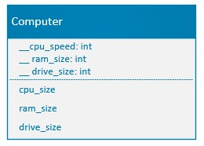
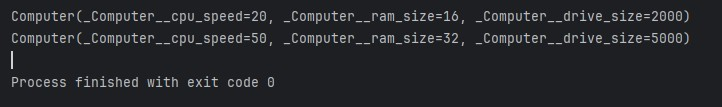

## Computer Dataclass

### Instructions:
 
- Create a _dataclass_ that represents a Computer using the following UML:  
  
- Use properties to get and set the values of the encapsulated attributes
- Create a program that instantiates two computers with appropriate values 
- Print the details of each computer object to the console using the implicit __str__ method.
- Enter your name, the lab number, and the current date into a set of comments at the top of the code.	
- Push the program source code to the assignment repo. 

### Example Output

### Evaluation:
- General, compiles, comments, proper indentation, etc  
- General dataclass definition 
- Use of dataclass
- Class attribute creation
- properties and decorators for accessing and mutating
- Object creation and use 
